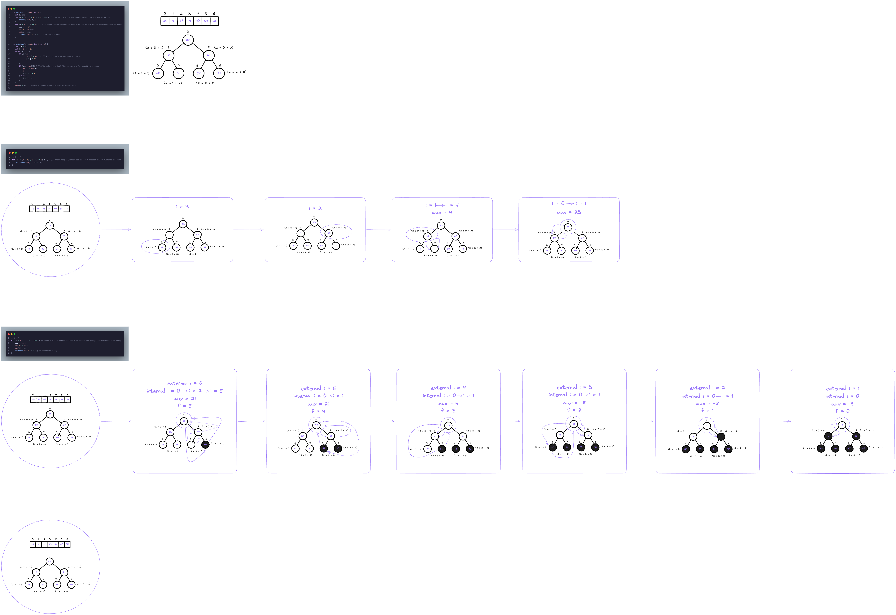

# HeapSort ou Ordenação usando heap
- Heap: vetor que simula uma arvore binária
completa (exceção do último nível)
- Todo elemento "pai" do vetor possui dois
elementos como "filhos"
- "pai" (i) -> "filhos": (2 * i + 1) e (2 * i + 2)

```txt
[23][ 4][67][-8][90][54][21]

                [23]
                /  \
              /      \
            /          \
        [ 4]            [67]
        /   \           /   \
    [-8]    [90]    [54]    [21]
````

